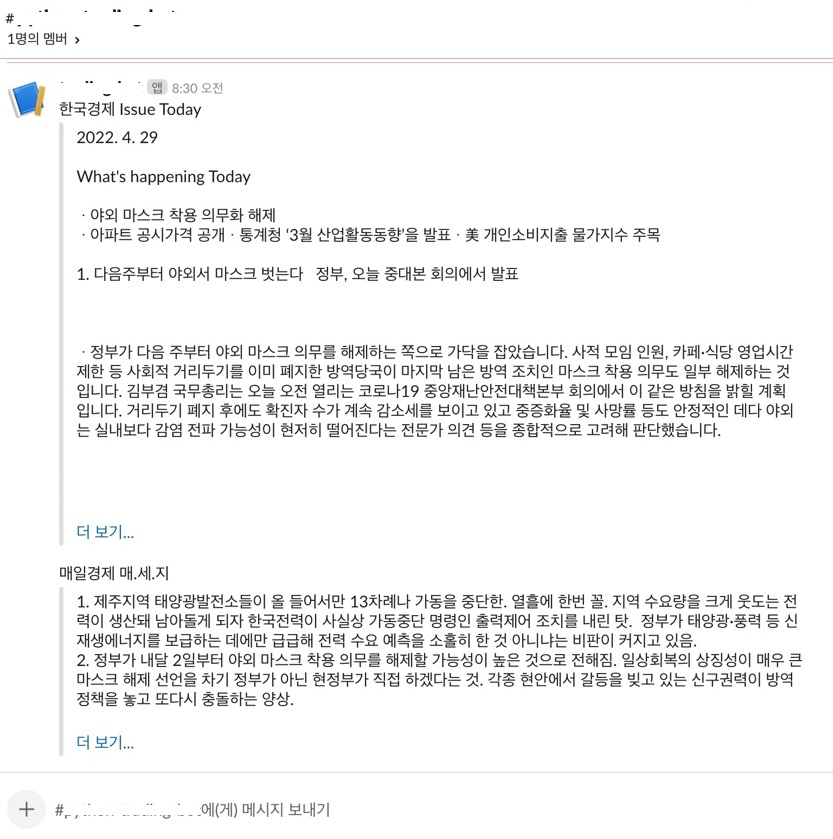
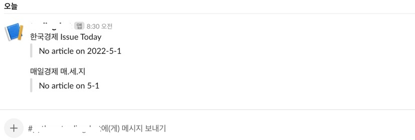
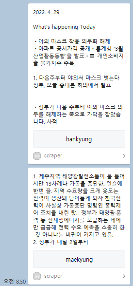
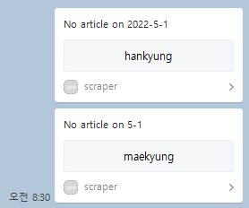

# scraping-news-go

go 기반 뉴스 스크래핑 데몬

## 🔵 웹 스크래핑(Web Scraping)

웹에 존재하는 데이터를 추출하는 기술

## 🔵 개발 환경

- CentOS Linux release 7.9.2009 (Core)
- go version go1.17.3 linux/amd64

## 🔵 기능 설명

- 매일경제의 `매경이 전하는 세상의 지식(매-세-지)` [링크](https://www.mk.co.kr/premium/series/20007/)
- 한국경제의 `한경 Issue Today` [링크](https://mobile.hankyung.com/apps/newsletter.view?topic=morning&gnb=)
...

매일 업데이트 되는 연재 기사들을 스크래핑해서 slack 채널 및 카카오톡으로 나에게 메시지를 전송한다.

## 🔵 Slack 메시지 예시

해당 날짜의 기사 전체를 스크래핑해서 채널에 메시지를 전송한다.

### ⚪ 정상 메시지 예시



### ⚪ No Article 예시



## 🔵 카카오톡 메시지 예시

[카카오톡 메시지 템플릿](https://developers.kakao.com/docs/latest/ko/message/message-template#text)의 텍스트는 최대 200자까지 표시되므로 버튼에 기사의 링크로 redirect 되도록 함

### ⚪ 정상 메시지 예시



### ⚪ No Article 예시




## 🔵 Slack Api Key 발급

https://api.slack.com/

1. Slack Workspace 생성
2. Slack App 추가
3. OAuth Token 발급을 위해 Workspace에 App을 Install
4. 발급된 토큰을 `keys.json` 에 추가

## 🔵 카카오톡 나에게 메시지 전송 기능을 위한 준비사항

### ⚪ 인가 코드 발급

- 브라우저에서 아래 url 실행

    https://kauth.kakao.com/oauth/authorize?client_id={REST_API_KEY}&redirect_uri=https://localhost:9090&response_type=code

- redirect된 url에서 code 가져오기

- 토큰 발급, 갱신 등에서 사용

### ⚪ Access Token 및 Refresh Token 발급

아래 명령을 수행하여 Access Token 및 Refresh Token을 발급 받고 `keys.json` 에 직접 업데이트한다.

```
curl -v -X POST "https://kauth.kakao.com/oauth/token" \
 -H "Content-Type: application/x-www-form-urlencoded" \
 -d "grant_type=authorization_code" \
 -d "client_id=1234567abcdefg" \
 -d "client_secret=ABCDEFG1234567" \
 --data-urlencode "redirect_uri=http://localhost:9090" \
 -d "code=A1B2C3D4E5F6G7"
```


### ⚪ Access Token 및 Refresh Token 갱신

기동 시 `keys.json`의 Access Token을 한 번 갱신하고

Access Token, Refresh Token은 각각 만료 1시간 전에 자동으로 갱신한다.

갱신된 Token은 `keys.json` 파일에도 자동으로 갱신한다.


## 🔵 keys.json format

```
{
 "slack_key": "abcdefg-1234567",
 "kakao": {
  "app_id": "12345",
  "key": "1234567abcdefg",                  # REST API Key
  "template": "54321",                      # 메시지 템플릿 ID
  "redirect_url": "http://localhost:9090",
  "authorization_code": "A1B2C3D4E5F6G7",
  "access_token": "abcdefg1234567",
  "refresh_token": "a1b2c3d4e5f6g7",
  "expires_in": 12345,
  "refresh_token_expires_in": 543210,
  "client_secret": "ABCDEFG1234567"
 }
}
```

## 🔵 카톡 봇 연동을 위한 API

PORT
PROXY - 30080

INTERNAL Kube Port
NEWYO - 30100
GOSCRAPER - 30200
